# NUFORC UFO Data Analysis

## Overview
This repository contains an analysis of the National UFO Reporting Center (NUFORC) dataset, exploring patterns and structures in reported UFO sightings. The dataset includes information on sighting locations, reported UFO shapes, durations, and witness descriptions.

## Dataset
The dataset consists of **84,795** reported UFO sightings with the following key attributes:

- **datetime**: Date and time of the sighting
- **city**: City where the sighting occurred
- **state**: State (if applicable)
- **country**: Country of the sighting
- **shape**: Reported shape of the UFO (e.g., circle, light, triangle)
- **duration (seconds)**: Duration of the sighting in seconds
- **duration (hours/min)**: Approximate duration in human-readable format
- **comments**: Description provided by the witness
- **date posted**: Date the sighting was reported to NUFORC
- **latitude/longitude**: Geographic coordinates of the sighting
- **timestamp**: UNIX timestamp of the sighting
- **shape_encoded**: Numerical encoding of the shape for analysis

## Persistent Homology Analysis
To investigate hidden topological structures within the dataset, we applied **persistent homology**, a technique from topological data analysis (TDA). The data was preprocessed using Principal Component Analysis (PCA) to reduce dimensionality before computing homological features.

### Persistence Diagrams
The following persistence diagrams illustrate the birth and death of topological features in the UFO dataset:

#### Overall Persistence Diagrams
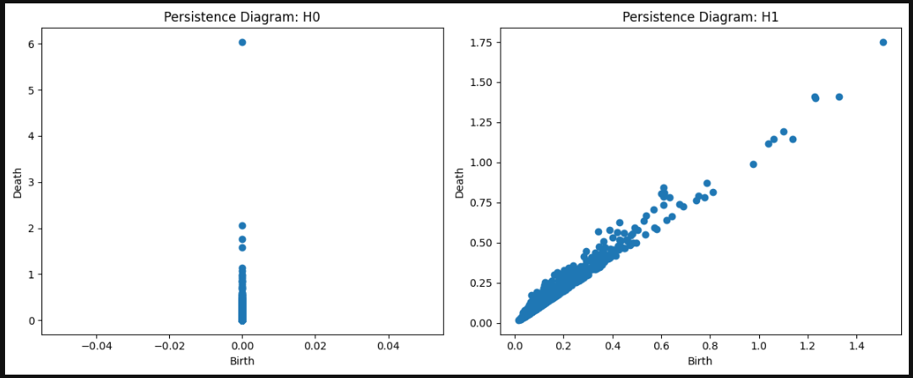

- **Left (H0 diagram)**: Represents connected components in the data, showing how clusters merge. Most components persist near **birth = 0**, indicating a dense core structure with very few isolated points.
- **Right (H1 diagram)**: Represents loops or cycles, revealing that most loops form and die quickly, suggesting limited topological complexity in the dataset's shape structure.

#### Persistence Diagrams by UFO Shape
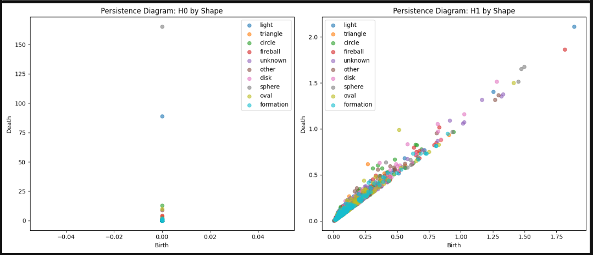

- Each color corresponds to a different UFO shape, showing variations in clustering and loop structures.
- Some shapes exhibit more persistent loops than others, indicating that particular UFO categories may exhibit unique clustering behaviors in the dataset.

## Principal Component Analysis (PCA)
To identify key features influencing UFO sightings, we performed PCA on the dataset and analyzed the contributions of different variables.

### PCA Loadings
The table below shows how different features contribute to the principal components:

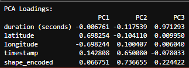

### Feature Contributions
Each principal component (PC) emphasizes different aspects of the data:

#### Feature Contributions to PC1
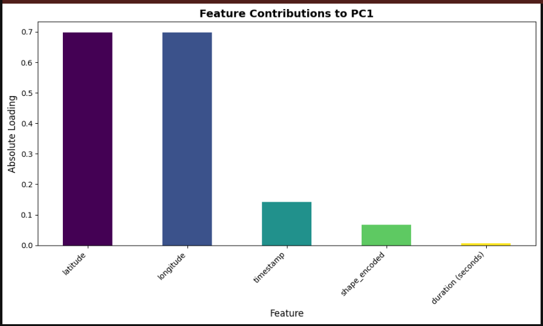
- **Latitude and longitude** are the dominant contributors, suggesting that location-based variance is the most significant factor in this dataset.
- This indicates that UFO sighting distribution is strongly tied to geography, potentially reflecting population density effects.

#### Feature Contributions to PC2
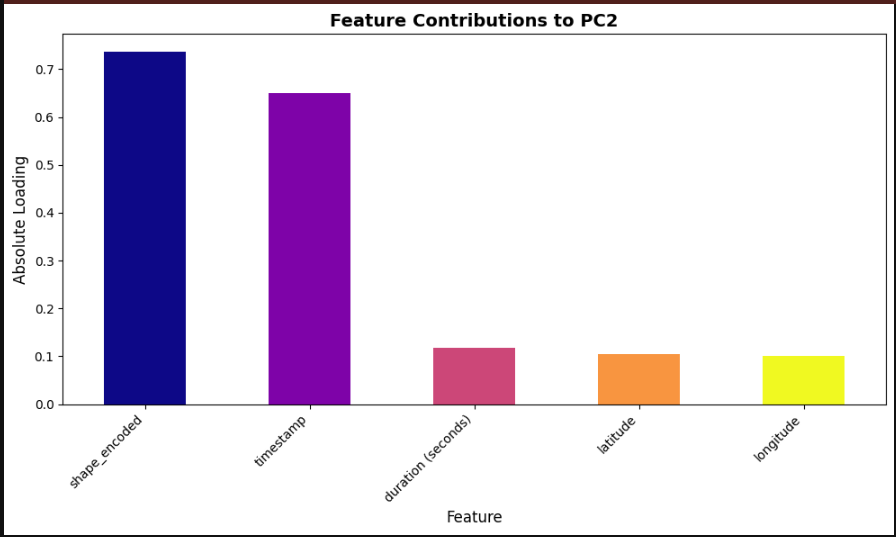
- **Shape encoding and timestamp** are the strongest contributors, showing that certain UFO shapes have distinct temporal trends.
- This could indicate shifts in UFO reports over time, possibly due to cultural influences or reporting biases.

#### Feature Contributions to PC3
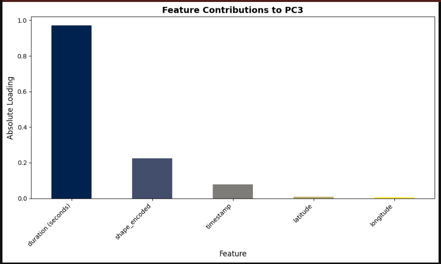
- **Duration (seconds)** dominates, meaning that UFO sighting durations vary significantly in ways not captured by the other components.
- This suggests that some sightings are disproportionately long or short compared to the overall dataset.

### PCA Projection (2D)
To visualize the principal components, we project the dataset into a 2D space using the first two principal components:

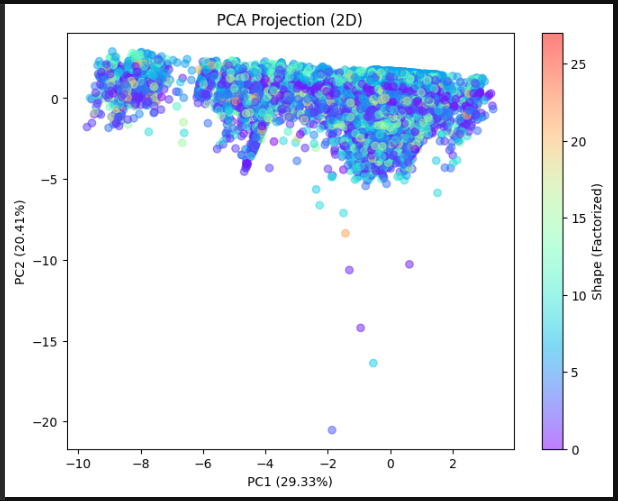

- The color gradient represents different UFO shapes (factorized values).
- **PC1 explains 29.33% of the variance, and PC2 explains 20.41%**, indicating that geography and UFO type account for a significant portion of variability in the data.
- The spread suggests that certain UFO shapes are more geographically clustered, while others are more uniformly distributed.

### PCA Projection (3D)
For deeper insights, we extend the projection to three dimensions:

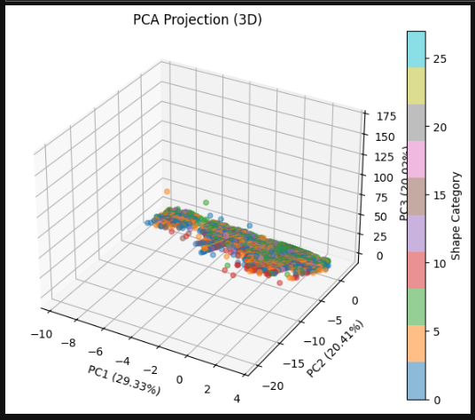

- The **third principal component (PC3)** incorporates duration, adding another layer of separation.
- The shape categories are still apparent, but the **vertical axis (PC3)** shows that some UFO shapes are associated with significantly longer or shorter durations.
- The data appears somewhat flattened in the PC3 direction, suggesting that while duration is a factor, its variance is more constrained compared to geographic spread and shape variability.

### Pairwise Relationships of PCA Components by Shape
To explore how different UFO shapes relate across the principal components, we examine pairwise distributions:

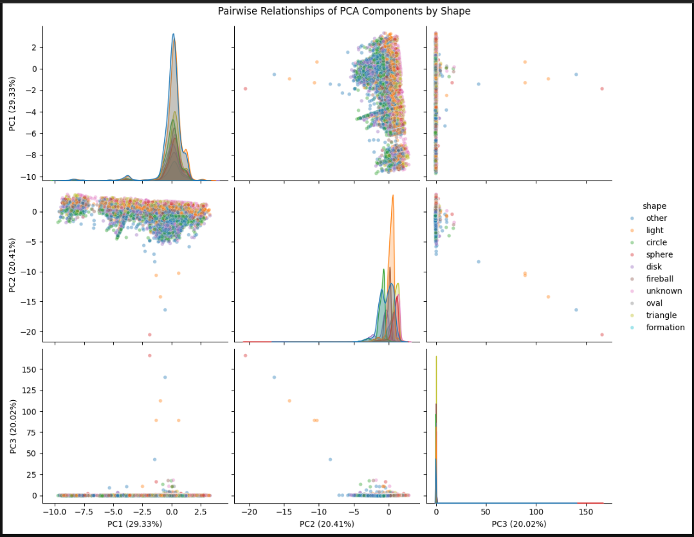

- This visualization reveals **clusters and density distributions for each UFO shape**.
- PC1 and PC2 show significant overlap across all shapes, meaning that most sightings share common spatial and temporal characteristics.
- **PC3 (duration-related variance) shows extreme outliers**, indicating that some sightings have highly unusual durations, possibly reflecting reporting inconsistencies or truly anomalous events.
- Certain UFO shapes, like **triangles and formations, have a more defined clustering structure**, suggesting that these shapes are more consistently reported within a specific range of variance.
---

## Interactive Dashboards

### 3D PCA Projection
A 3D visualization of the PCA-transformed data.

**Static Preview:**
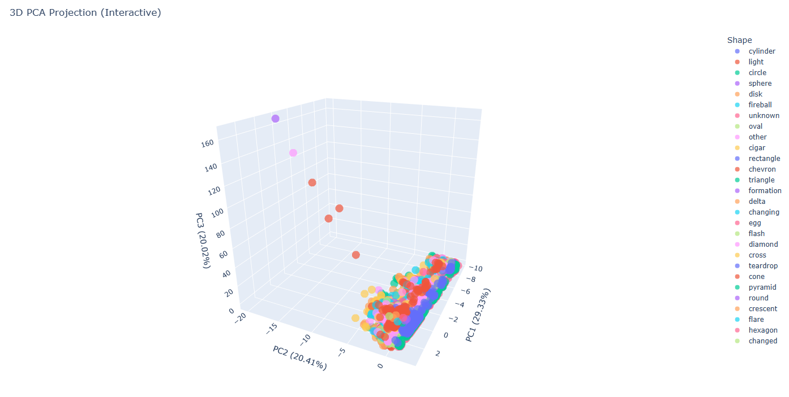

For an interactive version, open:  
➡️ [3D PCA Projection (Interactive)](https://bobovski66.github.io/NUFORC_Analysis/pca_3d_plot.html)


### Pairwise Relationships of PCA Components
Pairplot showing the relationships among principal components, colored by shape.

**Static Preview:**
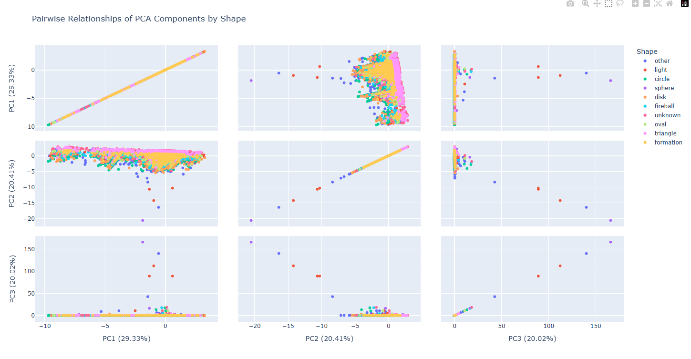

For an interactive version, open:  
➡️ [Pairplot Interactive](https://bobovski66.github.io/NUFORC_Analysis/pairplot_interactive.html)


---


## How to Use
1. Clone this repository:
   ```bash
   git clone https://github.com/your-username/nuforc-ufo-analysis.git
   ```
2. Run the analysis:
   ```bash
   PCA_Persist.ipynb
   ```

## Contributions
Contributions are welcome! Feel free to open an issue or submit a pull request with improvements or new insights.